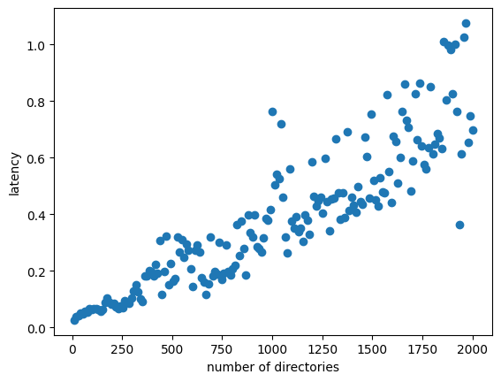

expects drives running locally

```
drives mirror --live test fejwthxe7fmpaeah8cocwmt7ba4h1kxq71wrtyk8dbgjsp3eth3o --storage /tmp/cortore
drives mirror --live fejwthxe7fmpaeah8cocwmt7ba4h1kxq71wrtyk8dbgjsp3eth3o test2 --storage /tmp/corestore2
```

then run `python3 measure_latency.py`


